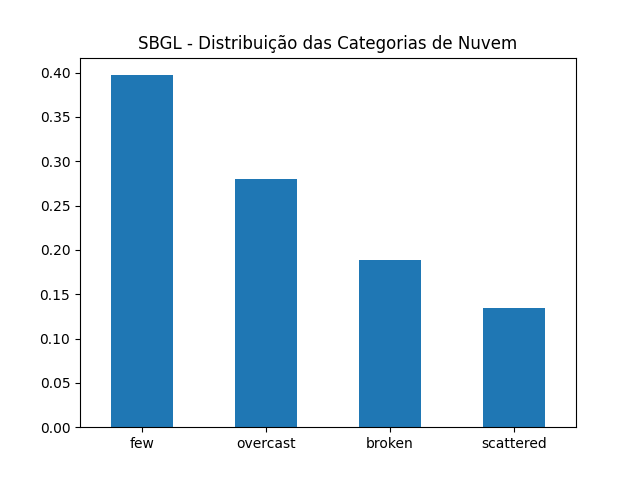

# PROGRAMAÇÃO APLICADA

## Trabalho 2
Antenor Barros Leal 2011241

-----------

# Resumo
Este trabalho detalha o processamento e análise de dados meteorológicos e de 
voos de aeroportos do sudeste brasileiro. A análise tem como objetivo identificar 
como as condições climáticas influenciam nos atrasos de voos.

Para responder esta pergunta usamos vários dataframes: um com as condições 
climáticas em um aeroporto e outros com as partidas e chegadas deste aeroporto.

O aeroporto escolhido será o do Galeão, por ter um maior movimento que o Santos
Dumont, portanto mais dados para serem analisados. Este aeroporto possui código ICAO
SBGL que será usado ao longo do código para se referir a este aeroporto.

Também serão comparados os atrasos com o aeroporto Santos Dumont, Congonhas e
Guarulhos.

# Bases de dados

## Base: Tempo

Possui as informações históricas metereológicas. É obtido acessando o endereço:
http://a4barros.com/public/prog-aplicada/tempo.zip

São quatro arquivos no formato 'dataset_ICAO.xlsx' onde

- ICAO=SBGL: Galeão
- ICAO=SBGR: Guarulhos
- ICAO=SBRJ: Santos Dumont
- ICAO=SBSP: Congonhas

### Descrição de colunas

- wind_direction: Direção **de onde** o vento sopra em graus;
- wind_speed: Velocidade do vento em nós (milhas nauticas por hora);
- temperature: Temperatura em graus Célsius;
- dew_point: Ponto de orvalho em graus Célsius;
- qnh: Referência para o altímetro;
- clouds_few: Alturas em pés separadas por vírgulas das altitudes que existem
nuvens few (1/8 a 2/8 do céu) presentes;
- clouds_scattered: O mesmo, mas para nuvens scattered (3/8 a 4/8 do céu);
- clouds_broken: O mesmo, mas para nuvens broken (5/8 a 7/8 do céu);
- clouds_overcast: O mesmo, mas para nuvens overcast (encoberto);
- timestamp: Data e hora destas condições.

## Base: Voos

Contém dados de pousos e decolagens em vários aeroportos do sudeste.
Pode ser obtida em http://a4barros.com/public/prog-aplicada/voos.zip

São vários arquivos no formato: 'YYYY-MM-DD-ICAO-arrivals.xlsx' ou 
'YYYY-MM-DD-ICAO-departures.xlsx'.

Arrivals se refere as chegadas e departures as partidas.

Por exemplo: 2024-10-29-SBGL-arrivals.xlsx São as chegadas para o Galeão do dia 29
de outubro.

### Descrição de colunas

- flight_date: Data no formato YYYY-MM-DD.
- flight_status: status do voo pode ser: active, landed, diverted, scheduled,
cancelled, unknown;
- departure_airport: Nome popular do aeroporto.
- departure_timezone: Fuso horário do aeroporto (ex.: America/Sao_Paulo);
- departure_iata: Código IATA do aeroporto de partida. (ex.: SDU);
- departure_icao: Código ICAO do aeoporto de partida (ex.: SBRJ);
- departure_terminal: Terminal de partida do voo;
- departure_gate: Portão de embarque de onde o voo parte (ex.: C02);
- departure_scheduled: Horário programado para a partida do voo no formato de hora
UTC (YYYY-MM-DDTHH:MM:SS+00:00);
- departure_estimated: Horário estimado para a partida do voo no formato de hora UTC;
- arrival_airport: Nome popular do aeroporto de chegada;
- arrival_timezone: Fuso horário do aeroporto de chegada, no formato de região. Ex.: America/Sao_Paulo;
- arrival_iata: Código IATA do aeroporto de chegada (ex.: GRU);
- arrival_icao: Código ICAO do aeroporto de chegada (ex.: SBGR);
- arrival_terminal: Terminal de chegada do voo;
- arrival_gate: Portão de desembarque onde o voo chega (ex.: A02);
- arrival_baggage: Número da esteira onde as bagagens do voo serão disponibilizadas (ex.: 04);
- arrival_delay: Atraso na chegada do voo em minutos, considerando o horário programado.
- arrival_scheduled: Horário programado para a chegada do voo no formato de hora 
UTC;
- arrival_estimated: Horário estimado para a chegada do voo no formato de hora UTC;
- airline_name: Nome da companhia aérea operadora do voo (ex.: LATAM Airlines);
- airline_iata: Código IATA da companhia aérea (ex.: LA para LATAM);
- airline_icao: Código ICAO da companhia aérea (ex.: TAM para LATAM);
- flight_number: Número único do voo designado pela companhia aérea (ex.: 1234);
- flight_iata: Código IATA completo do voo, formado pelo código da companhia e o número do voo (ex.: LA1234);
- flight_icao: Código ICAO completo do voo, formado pelo código ICAO da companhia e o número do voo (ex.: TAM1234).

# Perguntas respondidas

1. Quando os valores de vento não aparecem, significa que não há vento. Complete 
os valores ausentes de velocidade do vento com zero e os valores ausentes de 
direção com com a mediana das direções. Completar com a mediana é usada para que
ouliers não afetem algum cálculo de média feito com a direção do vento.
Mostre os 20 primeiros valores ordenados por velocidade de vento.

* Objetivos: Preparar a coluna de vento para posterior análise. Ter uma ideia
dos extremos de vento.

* Requisitos atendidos: 2 (preenchimento de valores ausentes)

2. Os valores de nuvens few (poucas), scatered (espalhadas), broken (muitas) e 
overcast (encoberto) são listas de números separados por vírgula com a altitude 
de cada nuvem. Por exemplo, few com valor "10000,12000" indicam poucas nuvens em 
10 mil pés e 12 mil pés.

Crie uma coluna 'nivel_nuvem' com o valor do tipo de nuvem mais encoberto 
seguindo a ordem few < scatered < broken < overcast. Para garantir que as nuvens 
realmente afetam o aeroporto, considere APENAS nuvens abaixo de 10 mil pés.

Qual o mais nebuloso (mais fechado) tipo de formação para cada valor de temperatura?
Parece haver relação entre a nebulosidade e a temperatura?

* Objetivo: Filtrar os dados de nuvem para os que podem influenciar o aeroporto.
Juntar dados de nuvem que estavam espalhados em quatro colunas em apenas uma
coluna com o tipo de nuvem mais crítico.

* Requisitos atendidos: 3 (apply), 8 (medidas de sumarização (grupos simples)),
7 (gráfico barra)


3. A velocidade de vento está expressa em nós (milhas náuticas por hora), converta 
para km/h. Crie as seguintes categorias para a velocidade do vento:

    * **Calmo:** Menor ou igual à 2km/h
    * **Bafagem:** 2 à 5 km/h
    * **Brisa leve:** 6 a 11km/h
    * **Brisa fraca:** 12 a 19km/h
    * **Brisa moderada:** 20 a 28km/h
    * **Brisa forte:** 29 a 38km/h
    * **Vento fresco:** 39 a 49km/h
    * **Vento forte:** 50 a 61km/h
    * **Ventania:** 62 a 74km/h
    * **Ventania forte:** 75 a 88km/h
    * **Tempestade:** 89 a 102km/h
    * **Tempestade violenta**: 103 a 117km/h
    * **Furacao:** Maior que 118km/h

Esta é chamada de Escala de Beaufort.

3.1. Faça uma tabela de frequências destas categorias e mostre em um gráfico pizza.
Qual é o tipo de vento mais presente?

3.2. Mostre uma tabela de frequência com o cruzamento das categorias de vento com os
valores de temperatura. Em qual faixa de temperatura ocorrem mais ventos?

3.3. Para cada faixa de vento mostre temperatura mínima, média, máxima e desvio 
padrão. Parece haver relação entre velocidade do vento e temperatura?

* Objetivo: Discretizar as velocidades de vento em categorias comumente usadas
na meteorologia e verificar a existência de relação entre as categorias de vento
e a temperatura.

* Requisitos atendidos: 4 (categorização com pd.cut), 3 (apply), 9 (cruzamento
simples), 8 (medidas de sumarização (grupos simples)), 7 (gráfico pizza)

4. Junte os dataframes de dados de voo de um mesmo aeroporto. Faça os dataframes 
chegadas_SBRJ e partidas_SBRJ. Crie um dataframe atraso_chegadas_SBRJ com os 
timestamps agrupados por hora e a média de tempo de atraso. Ou seja, para cada 
hora, teremos o tempo médio de atraso. Faça o mesmo para as partidas criando o 
dataframe atraso-partidas-SBRJ.

Faça um Merge da tabela de condições meteorológicas com os atrasos. Crie as 
colunas atraso_chegada e atraso_partida.

Faça o cruzamento de frequência entre o nível do vento e os atrasos e entre
a pior formação de nuvens e os atrasos. Parece haver uma correlação?

* Objetivo: Verificar a possível relação entre a piora das condições de tempo com
atrasos de voo.

* Requisitos atendidos: 1 (Concatenação), 2 (preenchimento de valores ausentes),
4 (categorização com pd.cut), 9 (cruzamento simples)

5. Calculando a diferença entre a temperatura e o ponto de orvalho temos um valor
que quanto mais baixo, maior chance de chuva. Quando a diferença é zero, temos
100% de chance de chuva. Retire valores maiores de 10 graus. Verifique se esta 
diferença tem influência nos atrasos para cada tipo de nuvem.
      
Repita o procedimento, mas considerando apenas condições muito adversas de tempo.
Visibilidade menor que 5000 e nuvens encobertas.

* Objetivo: Criar uma medida proporcional a chance a chuva e verificar se esta 
medida influencia nos atrasos.

* Requisitos atendidos: 9 (cruzamento estruturado), 5 (filtro)

# Conclusões

## 1

O aeroporto do Galeão, em relação a velocidade de vento, teve um outlier em que 
o vento chegou a 63 km/h no dia 29/10/2024 as 23h (UTC). O segundo vento mais 
veloz foi 19km/h dia 26/10 as 19h (UTC).

```
                           wind_direction  wind_speed  temperature  dew_point  ...
timestamp                                                                                                                                                 
2024-10-29 23:00:00+00:00            90.0        63.0           23         19  ...
2024-10-26 19:00:00+00:00           210.0        19.0           32         20  ...
2024-10-30 16:00:00+00:00           160.0        18.0           28         19  ...

```

## 2

Para o aeroporto analisado, temos uma correlação entre o a temperatura e o tipo
mais nebuloso de nuvem. De 20 graus até 26, temos apenas formações encobertas.
De 27 à 35 temos tanto algumas nuvens (broken) como nuvens espalhadas (scattered).
Na temperatura mais quente temos poucas nuvens.

```
----- Nível de nuvem por temperatura -----
            nivel_nuvem
temperature            
20             overcast
21             overcast
22             overcast
23             overcast
24             overcast
25             overcast
26             overcast
27               broken
28               broken
29               broken
30            scattered
31               broken
32               broken
33            scattered
34            scattered
35            scattered
36                  few
```

Porém na maior parte do tempo tivemos poucas nuvens como mostra o gráfico de
frequência. Porém elas são seguindas por nuvens encobertas.

