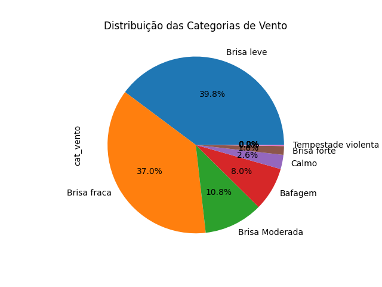

# PROGRAMAÇÃO APLICADA

## Trabalho 2
Antenor Barros Leal 2011241

-----------

# Resumo
Este trabalho detalha o processamento e análise de dados meteorológicos e de 
voos de aeroportos do sudeste brasileiro. A análise tem como objetivo identificar 
como as condições climáticas influenciam nos atrasos de voos.

Para responder esta pergunta usamos vários dataframes: um com as condições 
climáticas em um aeroporto e outros com as partidas e chegadas deste aeroporto.

O aeroporto escolhido será o do Galeão, por ter um maior movimento que o Santos
Dumont, portanto mais dados para serem analisados. Este aeroporto possui código ICAO
SBGL que será usado ao longo do código para se referir a este aeroporto.

Também serão comparados os atrasos com o aeroporto Santos Dumont, Congonhas e
Guarulhos.

# Bases de dados

## Base: Tempo

Possui as informações históricas metereológicas. É obtido acessando o endereço:
http://a4barros.com/public/prog-aplicada/tempo.zip

São quatro arquivos no formato 'dataset_ICAO.xlsx' onde

- ICAO=SBGL: Galeão
- ICAO=SBGR: Guarulhos
- ICAO=SBRJ: Santos Dumont
- ICAO=SBSP: Congonhas

### Descrição de colunas

- wind_direction: Direção **de onde** o vento sopra em graus;
- wind_speed: Velocidade do vento em nós (milhas nauticas por hora);
- temperature: Temperatura em graus Célsius;
- dew_point: Ponto de orvalho em graus Célsius;
- qnh: Referência para o altímetro;
- clouds_few: Alturas em pés separadas por vírgulas das altitudes que existem
nuvens few (1/8 a 2/8 do céu) presentes;
- clouds_scattered: O mesmo, mas para nuvens scattered (3/8 a 4/8 do céu);
- clouds_broken: O mesmo, mas para nuvens broken (5/8 a 7/8 do céu);
- clouds_overcast: O mesmo, mas para nuvens overcast (encoberto);
- timestamp: Data e hora destas condições.

## Base: Voos

Contém dados de pousos e decolagens em vários aeroportos do sudeste.
Pode ser obtida em http://a4barros.com/public/prog-aplicada/voos.zip

São vários arquivos no formato: 'YYYY-MM-DD-ICAO-arrivals.xlsx' ou 
'YYYY-MM-DD-ICAO-departures.xlsx'.

Arrivals se refere as chegadas e departures as partidas.

Por exemplo: 2024-10-29-SBGL-arrivals.xlsx São as chegadas para o Galeão do dia 29
de outubro.

### Descrição de colunas

- flight_date: Data no formato YYYY-MM-DD.
- flight_status: status do voo pode ser: active, landed, diverted, scheduled,
cancelled, unknown;
- departure_airport: Nome popular do aeroporto.
- departure_timezone: Fuso horário do aeroporto (ex.: America/Sao_Paulo);
- departure_iata: Código IATA do aeroporto de partida. (ex.: SDU);
- departure_icao: Código ICAO do aeoporto de partida (ex.: SBRJ);
- departure_terminal: Terminal de partida do voo;
- departure_gate: Portão de embarque de onde o voo parte (ex.: C02);
- departure_scheduled: Horário programado para a partida do voo no formato de hora
UTC (YYYY-MM-DDTHH:MM:SS+00:00);
- departure_estimated: Horário estimado para a partida do voo no formato de hora UTC;
- arrival_airport: Nome popular do aeroporto de chegada;
- arrival_timezone: Fuso horário do aeroporto de chegada, no formato de região. Ex.: America/Sao_Paulo;
- arrival_iata: Código IATA do aeroporto de chegada (ex.: GRU);
- arrival_icao: Código ICAO do aeroporto de chegada (ex.: SBGR);
- arrival_terminal: Terminal de chegada do voo;
- arrival_gate: Portão de desembarque onde o voo chega (ex.: A02);
- arrival_baggage: Número da esteira onde as bagagens do voo serão disponibilizadas (ex.: 04);
- arrival_delay: Atraso na chegada do voo em minutos, considerando o horário programado.
- arrival_scheduled: Horário programado para a chegada do voo no formato de hora 
UTC;
- arrival_estimated: Horário estimado para a chegada do voo no formato de hora UTC;
- airline_name: Nome da companhia aérea operadora do voo (ex.: LATAM Airlines);
- airline_iata: Código IATA da companhia aérea (ex.: LA para LATAM);
- airline_icao: Código ICAO da companhia aérea (ex.: TAM para LATAM);
- flight_number: Número único do voo designado pela companhia aérea (ex.: 1234);
- flight_iata: Código IATA completo do voo, formado pelo código da companhia e o número do voo (ex.: LA1234);
- flight_icao: Código ICAO completo do voo, formado pelo código ICAO da companhia e o número do voo (ex.: TAM1234).

# Perguntas respondidas

1. Quando os valores de vento não aparecem, significa que não há vento. Complete 
os valores ausentes de velocidade do vento com zero e os valores ausentes de 
direção com com a mediana das direções. Completar com a mediana é usada para que
ouliers não afetem algum cálculo de média feito com a direção do vento.
Mostre os 20 primeiros valores ordenados por velocidade de vento.

* Objetivos: Preparar a coluna de vento para posterior análise. Ter uma ideia
dos extremos de vento.

* Requisitos atendidos: 2 (preenchimento de valores ausentes), 8 (medidas de
sumarização: mediana)

2. Os valores de nuvens few (poucas), scatered (espalhadas), broken (muitas) e 
overcast (encoberto) são listas de números separados por vírgula com a altitude 
de cada nuvem. Por exemplo, few com valor "10000,12000" indicam poucas nuvens em 
10 mil pés e 12 mil pés.

Crie uma coluna 'nivel_nuvem' com o valor do tipo de nuvem mais encoberto 
seguindo a ordem few < scatered < broken < overcast. Para garantir que as nuvens 
realmente afetam o aeroporto, considere APENAS nuvens abaixo de 10 mil pés.

Qual o mais nebuloso (mais fechado) tipo de formação para cada valor de temperatura?
Parece haver relação entre a nebulosidade e a temperatura?

* Objetivo: Filtrar os dados de nuvem para os que podem influenciar o aeroporto.
Juntar dados de nuvem que estavam espalhados em quatro colunas em apenas uma
coluna com o tipo de nuvem mais crítico.

* Requisitos atendidos: 3 (apply), 8 (medidas de sumarização (grupos simples)),
7 (gráfico barra)


3. A velocidade de vento está expressa em nós (milhas náuticas por hora), converta 
para km/h. Crie as seguintes categorias para a velocidade do vento:

    * **Calmo:** Menor ou igual à 2km/h
    * **Bafagem:** 2 à 5 km/h
    * **Brisa leve:** 6 a 11km/h
    * **Brisa fraca:** 12 a 19km/h
    * **Brisa moderada:** 20 a 28km/h
    * **Brisa forte:** 29 a 38km/h
    * **Vento fresco:** 39 a 49km/h
    * **Vento forte:** 50 a 61km/h
    * **Ventania:** 62 a 74km/h
    * **Ventania forte:** 75 a 88km/h
    * **Tempestade:** 89 a 102km/h
    * **Tempestade violenta**: 103 a 117km/h
    * **Furacao:** Maior que 118km/h

Esta é chamada de Escala de Beaufort.

3.1. Faça uma tabela de frequências destas categorias e mostre em um gráfico pizza.
Qual é o tipo de vento mais presente?

3.2. Mostre uma tabela de frequência com o cruzamento das categorias de vento com os
valores de temperatura. Em qual faixa de temperatura ocorrem mais ventos?

3.3. Para cada faixa de vento mostre temperatura mínima, média, máxima e desvio 
padrão. Parece haver relação entre velocidade do vento e temperatura?

* Objetivo: Discretizar as velocidades de vento em categorias comumente usadas
na meteorologia e verificar a existência de relação entre as categorias de vento
e a temperatura.

* Requisitos atendidos: 4 (categorização com pd.cut), 3 (apply), 9 (cruzamento
simples), 8 (medidas de sumarização (grupos simples)), 7 (gráfico pizza),
6 (tabela de frequência com valores absolutos)

4. Junte os dataframes de dados de voo de um mesmo aeroporto.
Faça um Merge da tabela de condições meteorológicas com os atrasos. Crie as 
colunas atraso_chegada e atraso_partida.

Faça o cruzamento de frequência entre o nível do vento e os atrasos e entre
a pior formação de nuvens e os atrasos. Parece haver uma correlação?

* Objetivo: Verificar a possível relação entre a piora das condições de tempo com
atrasos de voo.

* Requisitos atendidos: 1 (Concatenação), 2 (preenchimento de valores ausentes),
4 (categorização com pd.cut), 9 (cruzamento simples)

5. Calculando a diferença entre a temperatura e o ponto de orvalho temos um valor
que quanto mais baixo, maior chance de chuva. Quando a diferença é zero, temos
100% de chance de chuva. Retire valores maiores de 10 graus, porque são outliers
e filtre por tempo muito nebuloso ou visibiliade menor que 5km.

* Objetivo: Criar uma medida proporcional a chance a chuva e verificar se esta 
medida influencia nos atrasos.

* Requisitos atendidos: 9 (cruzamento estruturado), 5 (filtro)

# Conclusões

## 1

O aeroporto do Galeão, em relação a velocidade de vento, teve um outlier em que 
o vento chegou a 63 km/h no dia 29/10/2024 as 23h (UTC). O segundo vento mais 
veloz foi 19km/h dia 26/10 as 19h (UTC).

```
                           wind_direction  wind_speed  temperature  dew_point  ...
timestamp                                                                                                                                                 
2024-10-29 23:00:00+00:00            90.0        63.0           23         19  ...
2024-10-26 19:00:00+00:00           210.0        19.0           32         20  ...
2024-10-30 16:00:00+00:00           160.0        18.0           28         19  ...

```

## 2

Para o aeroporto analisado, temos uma correlação entre o a temperatura e o tipo
mais nebuloso de nuvem. De 20 graus até 26 (inclusivo), temos apenas formações 
totalmente encobertas.
De 27 à 35 temos tanto nuvens (broken) como nuvens espalhadas (scattered).
Na temperatura mais quente (36) temos poucas nuvens.

```
----- Pior nível de nuvem abaixo de 10 mil por temperatura -----
            nivel_nuvem
temperature            
20             overcast
21             overcast
22             overcast
23             overcast
24             overcast
25             overcast
26             overcast
27               broken
28               broken
29               broken
30            scattered
31               broken
32               broken
33            scattered
34            scattered
35            scattered
36                  few
```

Porém na maior parte do tempo tivemos poucas nuvens como mostra o gráfico de
frequência. Porém elas são seguindas por nuvens encobertas.


## 3

### 3.1

Para este aeroporto temos a grande predominância de ventos leves como mostra
a tabela de frequência abaixo:

```
----- tabela de frequencia numérica de tipos de vento -----
Brisa leve             199
Brisa fraca            185
Brisa Moderada          54
Bafagem                 40
Calmo                   13
Brisa forte              8
Tempestade violenta      1
Vento fresco             0
Vento forte              0
Ventania                 0
Ventania fote            0
Tempestade               0
Furacao                  0
Name: cat_vento, dtype: int64
```

O tipo de vento mais presente é Brisa leve.

Vendo a mesma informação em forma de gráfico pizza temos:



### 3.2

A maior quantidade de ventos de qualquer tipo ocorre em 22 graus e em outras
temperaturas mais baixas.


### 3.3

O tipo de vento mais forte neste aeroporto (Tempestade violenta) ocorreu em uma 
temperatura mais baixa onde a amplitude estava zero. Porém não parece haver uma
relação significativa entre a temperatura e o tipo de vento.

```
                    temperature                amplitude
                            min max       mean          
cat_vento                                               
Calmo                        20  35  25.769231        15
Bafagem                      20  27  22.975000         7
Brisa leve                   20  34  24.266332        14
Brisa fraca                  20  36  26.194595        16
Brisa Moderada               21  35  27.555556        14
Brisa forte                  27  34  30.750000         7
Tempestade violenta          23  23  23.000000         0

```

### 4


Para partidas, nuvem do tipo few (poucas) parece influenciar atraso médio (10 a 30 min).
```
----- Crosstab nível de nuvem x atraso partida -----
nivel_nuvem       broken  few  overcast  scattered
atraso_partida                                    
baixo atraso           8   63        18         14
médio atraso          31  312        41         58
alto atraso           12   99         0         22
altíssimo atraso       0   25         0          1
```

Para chegadas o mesmo tipo de nuvem influencia baixo atraso.

```
----- Crosstab nível de nuvem x atraso chegada -----
nivel_nuvem       broken  few  overcast  scattered
atraso_chegada                                    
baixo atraso          45  456        50         87
médio atraso           1   32         7          8
alto atraso            5    7         0          0
altíssimo atraso       0    4         2          0
```

Ao contrário do que eu achada, ventos muito fortes não parecem causar mais atrasos.
A maioria dos atrasos se concentram em Brisa leve (6 a 11km/h). Mas o vento
um pouco mais forte (Brisa fraca, 12 a 19km/h) foi o único tipo que causou altísimo
atraso (mais que uma hora).

```
----- Crosstab categoria do vento x atraso partida -----
cat_vento         Calmo  Bafagem  Brisa leve  Brisa fraca  Brisa Moderada  Brisa forte
atraso_partida                                                                        
baixo atraso          0       11          79           40               1            0
médio atraso         41       12         370          110              13            1
alto atraso           0       43          57           32               3            0
altíssimo atraso      0        0           0           30               0            0
```

Para as chegadas, temos menos atrasos em geral que foram causados principalmente por
brisa leve e fraca.

```
----- Crosstab categoria do vento x atraso chegada -----
cat_vento         Calmo  Bafagem  Brisa leve  Brisa fraca  Brisa Moderada  Brisa forte
atraso_chegada                                                                        
baixo atraso         41       64         463          190              13            1
médio atraso          0        2          34           15               2            0
alto atraso           0        0           5            7               0            0
altíssimo atraso      0        0           4            0               2            0
```

### 5

Uma maior chance de chuva influencia na quantidade de atrasos como mostra a
tabela abaixo. Em três graus de diferença temos bem mais atrados que em diferenças
maiores.

```
nivel_nuvem overcast                                total_atrasos
atraso          10.0 12.0 14.0 16.0 17.0 32.0 246.0              
diff_temp                                                        
3                  0    0    0   31    0    6     0            37
4                  6    0    0    0    0    0     2             8
5                  0    9    0    0    0    0     0             9
6                  0    1    2    1    1    0     0             5
```

### 6

Nota-se que existem mais atrasos superiores a uma hora nas partidas. Vide as tabelas
Atraso médio por hora das partidas e Atraso médio por hora das chegadas no final
da página. 

Em atraso durante todo o período analisado nas partidas o aeroporto de Congonhas possui o maior somatório. Nas
chegadas é o Santos Dumont.

```
      atraso_partida_total  pior_atraso_partida  atraso_chegada_total  pior_atraso_chegada
ICAO                                                                                      
SBGL               16670.0                245.0                3572.0                244.0
SBGR               19574.0               1042.0                 420.0                 22.0
SBRJ               13691.0                260.0                6581.0                 95.0
SBSP               27915.0                162.0                4008.0                123.0

```

```
----- Atraso médio por hora das partidas ----- 
ICAO                        SBGL   SBGR   SBRJ        SBSP
row_0                                                     
2024-10-29 04:15:00+00:00    0.0  120.0    0.0    0.000000
2024-10-29 06:30:00+00:00    0.0    0.0    0.0   78.000000
2024-10-29 17:45:00+00:00    0.0    0.0   72.0   21.000000
2024-10-29 21:00:00+00:00    0.0    0.0   64.0    0.000000
2024-10-30 13:00:00+00:00    0.0    0.0    0.0   78.500000
2024-10-30 16:25:00+00:00    0.0    0.0    0.0   70.000000
2024-10-30 17:05:00+00:00    0.0    0.0    0.0  115.000000
2024-10-30 17:30:00+00:00  245.0    0.0    0.0   25.500000
2024-10-30 17:55:00+00:00    0.0    0.0  116.0    0.000000
2024-10-31 00:10:00+00:00    0.0  160.0    0.0    0.000000
2024-10-31 02:55:00+00:00  237.5    0.0    0.0    0.000000
2024-10-31 04:05:00+00:00    0.0  200.0    0.0    0.000000
2024-10-31 05:20:00+00:00    0.0  662.0    0.0    0.000000
2024-10-31 05:25:00+00:00    0.0  957.0    0.0    0.000000
2024-10-31 07:55:00+00:00   18.0    0.0   65.6    0.000000
2024-11-01 00:10:00+00:00    0.0   63.0    0.0    0.000000
2024-11-01 01:30:00+00:00    0.0  102.4    0.0    0.000000
2024-11-01 05:25:00+00:00    0.0   68.0    0.0    0.000000
2024-11-01 11:55:00+00:00   42.0    0.0    0.0   62.000000
2024-11-01 13:10:00+00:00    0.0    0.0    0.0   61.000000
2024-11-01 18:15:00+00:00    2.0    0.0    0.0   90.000000
2024-11-01 23:25:00+00:00   65.0    0.0    0.0    0.000000
2024-11-02 01:30:00+00:00    0.0   62.0    0.0    0.000000
2024-11-02 06:00:00+00:00    0.0  113.2    3.0   12.000000
2024-11-02 10:40:00+00:00    0.0    0.0   14.0   76.000000
2024-11-02 13:45:00+00:00    0.0    0.0   11.0   63.000000
2024-11-02 14:00:00+00:00    0.0    0.0    0.0   68.000000
2024-11-02 15:35:00+00:00   86.0    0.0    2.0    0.000000
2024-11-02 16:30:00+00:00    0.0    0.0    2.0   67.000000
2024-11-03 06:45:00+00:00   75.0   22.0    0.0    0.000000
2024-11-03 10:30:00+00:00    0.0    0.0   85.0    0.000000
2024-11-03 16:25:00+00:00    0.0    0.0   82.0   15.000000
2024-11-03 18:15:00+00:00    8.0    0.0    0.0   71.000000
2024-11-03 18:40:00+00:00    0.0    0.0    0.0   69.000000
2024-11-03 20:50:00+00:00  180.0    0.0    0.0    0.000000
2024-11-04 05:00:00+00:00    0.0   69.0    0.0    0.000000
2024-11-04 09:20:00+00:00    0.0    0.0    4.5  119.000000
2024-11-04 09:45:00+00:00    0.0    0.0    0.0   61.000000
2024-11-04 10:05:00+00:00   20.0    0.0    0.0   63.000000
2024-11-04 10:10:00+00:00    0.0    0.0    0.0  119.000000
2024-11-04 10:15:00+00:00    0.0    0.0    0.0  104.000000
2024-11-04 10:25:00+00:00    0.0    0.0    0.0   73.000000
2024-11-04 10:30:00+00:00    0.0    0.0   78.0    0.000000
2024-11-04 10:40:00+00:00    0.0    0.0   30.0   68.500000
2024-11-04 11:05:00+00:00   20.0    0.0   80.0    0.000000
2024-11-04 11:20:00+00:00    0.0    0.0    0.0   81.333333
2024-11-04 11:40:00+00:00    0.0    0.0   21.0   68.500000
2024-11-04 13:45:00+00:00    0.0    0.0   30.0   80.000000
2024-11-04 14:15:00+00:00    0.0    0.0   24.0   82.000000
2024-11-04 14:30:00+00:00    0.0    0.0    0.0   75.000000
2024-11-04 14:45:00+00:00    0.0    0.0   97.0   46.000000
2024-11-04 15:40:00+00:00   10.0    0.0    0.0   90.000000
2024-11-04 16:10:00+00:00    0.0    0.0    0.0   97.000000
2024-11-04 16:25:00+00:00    0.0    0.0    0.0   96.000000
2024-11-04 17:00:00+00:00    0.0    0.0   68.0    0.000000
2024-11-04 17:05:00+00:00    0.0    0.0    0.0   88.000000
2024-11-04 17:15:00+00:00    0.0    0.0    0.0   72.000000
2024-11-04 17:35:00+00:00    0.0    0.0   82.0    0.000000
2024-11-04 18:00:00+00:00    0.0    0.0   22.0   81.000000
2024-11-04 18:05:00+00:00    0.0    0.0   88.0    0.000000
2024-11-04 18:15:00+00:00   30.0    0.0    0.0  112.000000
2024-11-04 18:30:00+00:00    0.0    0.0    0.0  110.000000
2024-11-04 18:40:00+00:00    0.0    0.0   69.0    0.000000
2024-11-04 19:20:00+00:00    0.0    0.0  100.0    0.000000
2024-11-05 00:05:00+00:00    0.0   70.0    0.0    0.000000
2024-11-05 01:25:00+00:00   81.0    0.0    0.0    0.000000
2024-11-05 01:40:00+00:00    0.0   64.0    0.0    0.000000
2024-11-05 06:30:00+00:00    0.0   14.0    0.0   74.000000
2024-11-05 08:15:00+00:00    0.0    0.0    0.0   69.000000
2024-11-05 09:55:00+00:00    0.0    0.0   82.0    0.000000
2024-11-05 10:05:00+00:00  173.0    0.0    0.0   47.000000
2024-11-05 11:50:00+00:00    0.0    0.0   68.0    0.000000
2024-11-05 14:30:00+00:00    0.0    0.0    0.0   91.000000
2024-11-05 14:45:00+00:00    0.0    0.0   69.0   44.000000
2024-11-05 15:40:00+00:00   24.0    0.0    0.0   67.000000
2024-11-05 16:25:00+00:00    0.0    0.0    0.0   92.000000
2024-11-05 17:05:00+00:00    0.0    0.0    0.0   81.000000
2024-11-05 17:15:00+00:00    0.0    0.0    0.0   61.000000
2024-11-05 18:15:00+00:00   90.0    0.0    0.0    0.000000
2024-11-06 03:55:00+00:00    0.0   70.0    0.0    0.000000
2024-11-06 07:25:00+00:00    0.0   97.0    0.0    0.000000
2024-11-06 08:00:00+00:00    0.0    0.0   11.0   64.500000
2024-11-06 08:25:00+00:00   13.0    0.0    2.0  111.000000
2024-11-06 10:05:00+00:00   94.0    0.0    0.0   17.000000
2024-11-06 11:45:00+00:00    0.0    0.0  116.0    0.000000
2024-11-06 12:35:00+00:00    0.0    0.0  132.0   35.000000
2024-11-06 13:25:00+00:00    0.0    0.0   79.0    0.000000
2024-11-06 14:30:00+00:00    0.0    0.0    0.0  129.000000
2024-11-06 15:40:00+00:00    9.0    0.0    0.0  162.000000
2024-11-06 17:00:00+00:00    0.0    0.0   68.0    0.000000
2024-11-06 17:05:00+00:00    0.0    0.0    0.0   75.000000
2024-11-06 17:15:00+00:00    0.0    0.0    0.0   61.500000
2024-11-06 17:25:00+00:00    0.0    0.0   65.0    0.000000
2024-11-06 18:05:00+00:00    0.0    0.0   72.0    0.000000
2024-11-06 18:15:00+00:00  210.0    0.0    0.0   40.000000
2024-11-06 18:30:00+00:00    0.0    0.0    0.0   70.000000
2024-11-06 19:40:00+00:00    0.0    0.0   94.0    0.000000
2024-11-06 21:05:00+00:00  135.0    0.0    0.0    0.000000
2024-11-07 00:40:00+00:00    0.0   63.0    0.0    0.000000
2024-11-07 07:55:00+00:00   70.0    9.0    0.0    0.000000
2024-11-07 08:35:00+00:00    0.0    0.0    0.0   84.000000
2024-11-07 08:50:00+00:00    0.0    0.0    0.0   72.000000
2024-11-07 09:30:00+00:00    0.0   15.0    8.0   62.500000
2024-11-07 10:40:00+00:00    0.0    0.0   39.5   68.000000
2024-11-07 11:05:00+00:00    0.0    0.0   80.0    0.000000
2024-11-07 11:10:00+00:00    0.0    0.0    0.0   95.000000
2024-11-07 11:20:00+00:00    0.0    0.0    0.0   69.000000
2024-11-07 11:55:00+00:00    0.0    0.0    0.0   85.000000
2024-11-07 12:00:00+00:00    0.0    0.0    0.0   61.000000
2024-11-07 12:35:00+00:00    0.0    0.0   15.0  138.000000
2024-11-07 12:40:00+00:00   77.0    0.0    0.0    0.000000
2024-11-07 12:50:00+00:00    0.0    0.0    1.0   82.000000
2024-11-07 13:00:00+00:00    0.0    0.0    0.0   75.000000
2024-11-07 13:10:00+00:00    0.0    0.0    0.0   72.000000
2024-11-07 13:30:00+00:00    0.0    0.0   75.0  108.000000
2024-11-07 13:35:00+00:00    0.0    0.0    0.0   67.000000
2024-11-07 14:15:00+00:00    0.0    0.0    0.0   75.000000
2024-11-07 14:30:00+00:00    0.0    0.0    0.0  107.000000
2024-11-07 15:00:00+00:00    0.0    0.0   68.0   41.000000
2024-11-07 15:40:00+00:00   23.0    0.0    0.0   71.000000
2024-11-07 16:00:00+00:00    0.0    0.0    0.0  103.500000
2024-11-07 17:05:00+00:00    0.0    0.0   61.0  128.000000
2024-11-07 17:15:00+00:00    0.0    0.0    0.0   97.500000
2024-11-07 18:00:00+00:00    0.0    0.0   45.0  101.000000
2024-11-07 18:05:00+00:00    0.0    0.0   76.0    0.000000
2024-11-07 18:50:00+00:00    0.0    0.0    0.0   78.000000
2024-11-07 18:55:00+00:00    0.0    0.0   34.0   92.000000
----- Atraso médio por hora das chegadas ----- 
ICAO                        SBGL  SBGR    SBRJ   SBSP
row_0                                                
2024-10-29 10:55:00+00:00  240.0   0.0   0.000    0.0
2024-10-29 17:10:00+00:00    0.0   0.0  69.000    0.0
2024-10-30 10:55:00+00:00  244.0   0.0   0.000    0.0
2024-10-31 07:40:00+00:00    0.0   0.0   0.000   67.0
2024-10-31 14:35:00+00:00    0.0   0.0   0.000  123.0
2024-11-01 08:20:00+00:00    0.0   0.0   6.375   75.0
2024-11-01 19:05:00+00:00   64.0   0.0  12.000    0.0
2024-11-02 15:30:00+00:00    0.0   0.0  75.000    0.0
2024-11-03 09:50:00+00:00    0.0   0.0  82.000    0.0
2024-11-03 12:25:00+00:00    0.0   0.0   0.000   63.0
2024-11-03 15:50:00+00:00    0.0   0.0  65.000    0.0
2024-11-03 18:40:00+00:00  198.0   0.0   0.000    0.0
2024-11-04 07:15:00+00:00    0.0   0.0   0.000   67.0
2024-11-04 14:05:00+00:00    0.0   1.0  68.000   54.0
2024-11-04 19:30:00+00:00    0.0   0.0  73.000    0.0
2024-11-05 09:05:00+00:00    0.0   0.0  81.000    0.0
2024-11-05 09:15:00+00:00  148.0   0.0   0.000    0.0
2024-11-06 08:20:00+00:00    0.0   0.0  82.000    0.0
2024-11-06 20:00:00+00:00    0.0   0.0  64.000    0.0
2024-11-07 10:25:00+00:00    2.0   0.0  64.000    1.0
2024-11-07 11:35:00+00:00    0.0   0.0   0.000   61.0
2024-11-07 13:15:00+00:00    0.0   0.0  64.000    0.0
2024-11-07 14:10:00+00:00    0.0   0.0   0.000   71.0
2024-11-07 17:20:00+00:00    0.0   0.0  66.000    0.0
2024-11-07 18:25:00+00:00    0.0   0.0  78.000    0.0
```